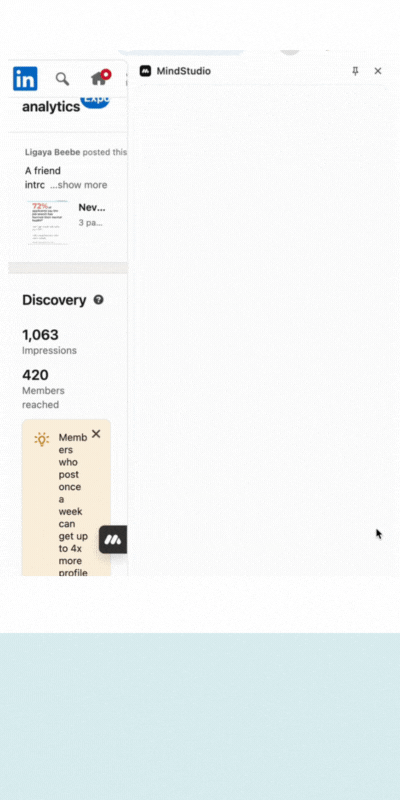

# analytics-buddy
MindStudio-powered browser extension workflow for capturing personal social media analytics and exporting to Google Sheets.

# Analytics Buddy

> A MindStudio-powered browser extension that captures **personal social media** post analytics from the page, converts them into CSV, and updates a connected Google Sheet. The sheet runs simple formulas for insights, which can be fetched back into MindStudio.

## Demo
  

## Why I built it
I don’t have enterprise analytics, and manual tracking (CSV downloads or copy/paste per post) was slow and messy. Analytics Buddy turns that into a one-click flow so I can spend time on **learning** rather than **wrangling data**.

## Features & Stack
- Runs in a **browser extension** to grab page content
- **MindStudio** flow converts content → CSV
- **Google Sheets** computes simple insights (top posts, 7-day trends, engagement rate)
- (Optional) MindStudio fetches Sheet insights back for instant feedback

## How it works (high-level)
1. Click the extension on a relevant page  
2. The flow extracts visible metrics from page content  
3. Model formats those metrics as **CSV**  
4. CSV rows are appended/updated in **Google Sheets**  
5. Sheet formulas compute insights (top posts, trends)  
6. (Optional) Insights are fetched back into MindStudio

## Sample Outputs
- Dummy CSV: [`data-samples/sample-analytics.csv`](data-samples/sample-analytics.csv)  

## Limitations
- Page capture can be **unstable**; sometimes only metadata is available  
- Occasionally requires a browser refresh/restart  
- Analytics are **basic** by design (relies on Google Sheets formulas)

## Ethics & TOS
This project is for **personal analytics** only. It does not expose live agents or automate actions on others’ platforms. Demo is available upon request.

---

## Repo Map
